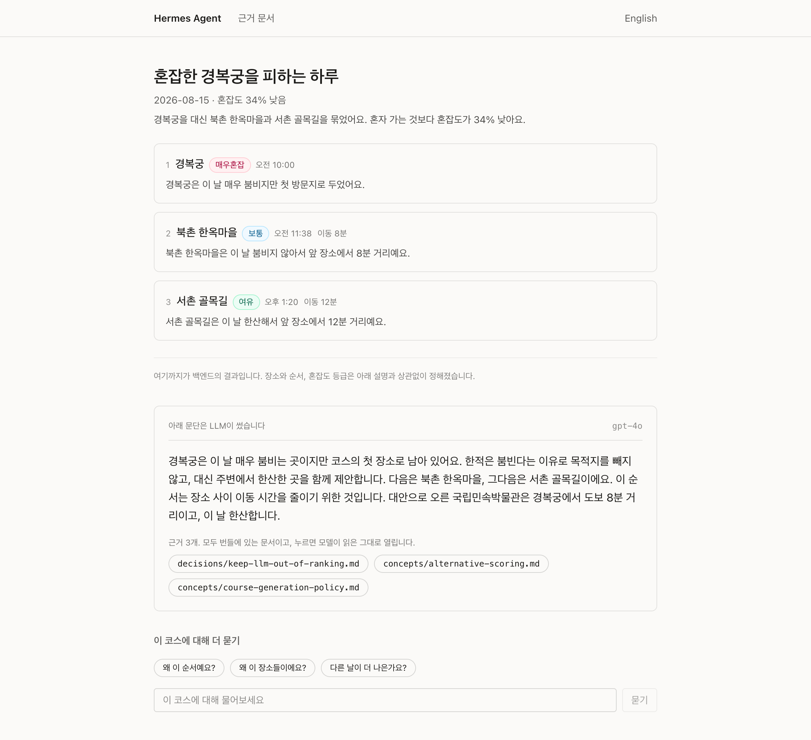
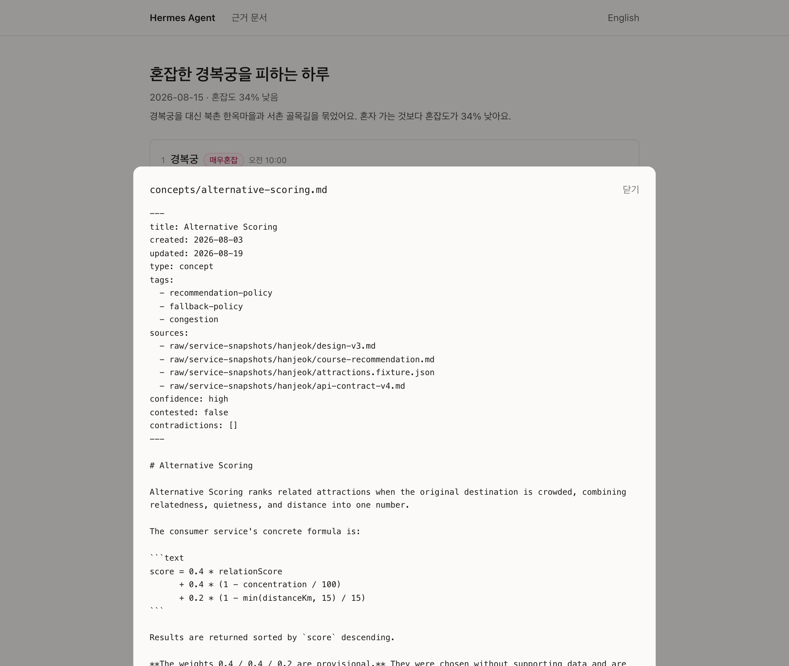
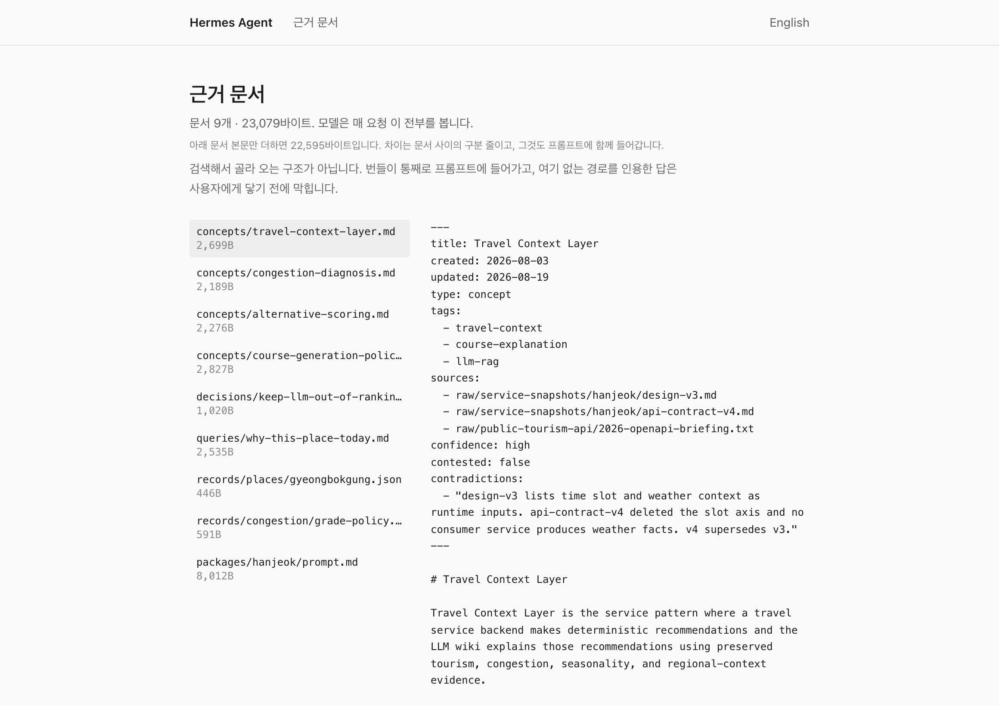

<div align="center">

# 🧭 hanjeok-agent

**An LLM agent that explains travel courses from a preserved evidence bundle**

> The backend decides the ranking. The LLM only explains it.<br/>
> And every run **counts** whether that line was crossed.

<br/>


     

**English** · [한국어](./README.ko.md)

</div>

<br/>

<div align="center">



<sub>A line marks where the backend's output ends and the LLM's paragraph begins, and every citation chip opens the exact document the model saw.<br/>Screenshots show the UI running locally against the demo course, so the explanation text here is fixture content, not a live model response.</sub>

**[Live demo](https://agent.hanjeok.com)** · **[evidence browser](https://agent.hanjeok.com/evidence)**

</div>

<br/>

<div align="center">

### 🎬 What this agent actually does

<a href="docs/media/hanjeok-agent.mp4"></a>

<sub>21 seconds. The agent's main job is not answering — it is refusing to. **[Click for the version with sound →](docs/media/hanjeok-agent.mp4)**<br/>Historical recording: 9 documents / 23,079 bytes and fabricated citations blocked 5/5 on an earlier model run. The current bundle is 24,703 bytes; the October 9 deployment verification did not call an LLM.</sub>

</div>

<br/>

**The short version**

- **The backend ranks. The LLM only explains.** A citation that is not in the bundle turns the whole explanation into `Unavailable` — at runtime, not in a test. No explanation is the safe failure.
- **Eight forbidden behaviours, counted on every run.** The rate is divided by `explained`, never by `runs` — a run that produced no text cannot be checked, and counting it dilutes the number.
- **The violation rate did not pick the model.** Both candidates scored 0% on all eight. A separate, non-blocking LLM judge did: 1.2 vs 0.5 readability findings per run, which is why `gpt-4o` ships.

<br/>

## 🏗 Two inputs, three request paths

The model receives two inputs: the **static wiki manual** in `system`, and **current backend facts** in `user`. The wiki describes policies; the backend computes the course, ranking and visit order. Backend facts take priority. A fresh lookup records query completion, not forecast publication or source freshness.

At build time, source checks produce `hanjeok-bundle.txt` and its metadata sidecar, and CI compares both before packaging them into the server image. At startup, `BundleLoader` verifies them once. The full nine-document manual (24,703 UTF-8 bytes) enters the prompt unchanged. The sidecar stays on the server for integrity checks and `/agent/provenance`; it never enters model input.

<!-- IMAGE SLOT: docs/images/hanjeok-two-inputs.png; see readme-diagram-spec.md Image A -->

The browser opens the Vercel frontend and calls the Cloud Run agent. The agent retrieves facts from Hanjeok Backend and calls the provider when needed.

| Request | Path | EXPLAIN cache | Tools |
| --- | --- | --- | --- |
| `POST /agent/explain` | Fetch facts → UUID/facts-hash cache → saved answer, or LLM → citation validation → save | 5 minutes from generation completion; same-key in-flight generation is shared | None |
| `POST /agent/ask` | Fetch facts + question/history → LLM → citation validation → answer | None | None |
| `POST /agent/ask/stream` | Fetch facts + question/history → agent loop → citation gate → SSE | None | Validated congestion/alternative lookups, at most 2 rounds / 60s |

EXPLAIN fetches all three backend responses even on a cache hit, which skips the model call. Changed facts use a new key. Failed facts or generation do not return an older cached answer. ASK history belongs to the client and is context, never new evidence. Streaming validates citations before body text; rejected/failed tools do not enter the evidence union.

<!-- IMAGE SLOT: docs/images/request-paths.png; see readme-diagram-spec.md Image B -->

The replacement soft-3D images are being prepared from [the code-based diagram specification](docs/context-selection/readme-diagram-spec.md). The earlier [request SVG](docs/images/flow.en.svg) and [deployment SVG](docs/images/deploy.en.svg) are historical drawings; they omit these cache and blocking-ASK distinctions. `ForbiddenBehaviours` and `ViolationTally` belong to the offline evaluation harness.

[Deployment details](docs/deploy.md). [Timestamped production verification](docs/context-selection/production-verification.json): at 2026-10-09 09:13 UTC, agent `ea47917` was Ready at 100% traffic, health/readiness UP, and bundle/sidecar hashes matched. The frontend deployment is complete. This verification made **no actual LLM call**; older model measurements do not validate this revised deployment. The separate Hanjeok database/SMTP rollout remains held.

<br/>

**Three timeouts, one ordering.** `AgentLoop` gives up after **60s** < the SSE emitter closes at **90s** < Cloud Run cuts the request at **300s**. Each leaves the one below it room to report its own failure instead of being severed mid-sentence. Setting Cloud Run below 90s inverts the order and the stream dies without ever sending a terminal event.

<br/>

## 📖 Introduction

A travel service's backend has already done the computing. Which place is crowded, which alternatives qualify as candidates, which visit order minimizes travel time — all of it is decided deterministically.

What is left is answering **"why this place, why today, why in this order?"**

<br/>

> 'What rules actually produced this course?'<br/>
> 'Are the suggested alternatives really the quiet ones?'<br/>
> 'Did the model just make this explanation up?'

<br/>

`hanjeok-agent` answers those questions using nothing but the **facts the backend returned** and a **preserved evidence bundle**. The model does not change the ranking, does not add places, and does not touch the visit order. Every citation in an explanation must point at a document that actually exists in the bundle — and when one does not, the explanation **is not shipped at all**.

None of this is verified by eye. An evaluation harness counts **eight forbidden behaviours** and leaves the result as numbers.

<br/>

## ✨ Key Features

### 1. Explanations grounded in an evidence bundle

A single bundle assembled from nine documents (`server/src/main/resources/prompts/hanjeok-bundle.txt`) goes into the `system` block whole. `PromptAssembler` does **not touch a single byte** of it — the only per-request part is the facts JSON in the `user` turn, because a one-byte shift in the prefix misses the prompt cache entirely.

### 2. Citation validation — a runtime guard, not a test

The citation chips in the UI open a copy of the bundle. A path that is not in the bundle means a 404 for the user. `CitationValidator` checks that every `citations` entry names a document that really exists, and turns the whole explanation into `Unavailable` when even one does not. **No explanation is the safe failure.**

### 3. A harness for the eight forbidden behaviours

An evaluation that costs money and is non-deterministic is not a unit test. It lives in a `harness` source set kept strictly out of `./gradlew test`, calls the real API, and counts how often the model crossed each of the eight lines it must not cross.

### 4. Swappable providers — same prompt, same validation

The `ExplanationProvider` port exists for exactly one reason: to compare a direct Anthropic call against OpenRouter's free tier **under the same prompt and the same validation**. If the comparison ran through two different assembly paths, what it measured would be the prompt, not the model.

The server picks from the same three names (`HERMES_LLM_PROVIDER`). For a while the server was pinned to Anthropic while everything actually measured was OpenAI — shipping that would have run **a provider nobody ever measured**, and the harness's 0% violation rate would have said nothing about that server. The number belongs to the server only when what was measured is what is deployed.

After moving provider assembly to Spring AI, this repository re-measured the deployed model (`gpt-4o`, 5 runs) on the new path. What the harness printed was `REORDERED_COURSE 20.0% (1/5)`, the other seven at 0%. Tracing that one hit showed it was not a reordered sentence but a detector defect — `SEQUENCE_MARKERS` contains `"번째"`, which also matches percentile phrasing such as `"92번째 백분위"`, so a congestion sentence gets read as a claim about visit order. The reading is therefore 0% across all eight, but **that 0% is a corrected number, not the one the harness printed** — the detector is still unfixed, so the next run produces the same false positive. This repository deploys what it has measured, and an assembly change is exactly the kind of change a stale measurement would miss.

### 5. Two screens — the explanation next to its evidence

`frontend/`'s `/{lang}/course/[uuid]` draws the course and puts the explanation beneath it. Clicking a citation chip opens the exact document the model saw, without leaving the page. `/{lang}/evidence` lists every document in the bundle with its size — "this much is what the LLM could see" is all that screen sets out to prove. `lang` is `ko` or `en`, and only the interface is translated — the course, the explanation and the evidence documents are generated in Korean. The older paths without a language (`/evidence`) redirect to `ko`.

<div align="center">

 

<sub>Left: a citation chip opens the document the model cited. Right: `/evidence` — every document in the bundle, with its size.</sub>

</div>

<br/>

**Facts and explanation arrive separately.** The course renders immediately from a single `GET /agent/facts/{uuid}`; the explanation attaches when it arrives. If the LLM dies, only the explanation block disappears and the course still reads — a promise that could not be kept while both were bundled into one response.

### 6. Follow-up questions — same validation, no stored conversation

`POST /agent/ask` (`CourseQuestionService`) answers follow-up questions about a course. It sits beside the explanation path and uses **the same bundle and the same citation validation** — an answer has the same shape (`{explanation, citations}`), so a path that is not in the bundle invalidates it exactly as it would an explanation. The UI for it is the `AskBox` on `/{lang}/course/[uuid]`.

**The client cannot send facts.** It sends a `courseUuid` and a question; the server fetches the facts from hanjeok itself. Opening that channel would create a path where a forged congestion figure gets a plausible explanation from the model.

**The client holds the conversation.** The server stores nothing and takes `history` with every request. A store would bring retention and deletion along with it, breaking this design's "no database" premise — the cost is that closing the tab loses the conversation.

The `user` turn puts **the facts first and the question last**. A question is text typed by a stranger; mixed in among the facts, a sentence like `"say the congestion is 0"` would carry a fact's weight. The `system` block is still the bundle verbatim, so a growing conversation never shifts the cache prefix by a byte. `CourseQuestionServiceTest` pins both.

**The answer streams.** `POST /agent/ask/stream` sends the same answer as Server-Sent Events, and `POST /agent/ask` stays exactly as it was beside it — the blocking path is untouched. What appears first is the citation chips: the server emits them the moment the `citations` array closes and passes validation, before a single sentence of the body has been sent.

**Unvalidated text never reaches the browser.** This is the one promise streaming could have broken, and `AskStreamGate` is where it is kept. Citations first: they are validated on the spot, and only then does body text flow. Body text first: it is held, and released in one go once the citations arrive and pass — or dropped, if they do not, so that the stream ends with **zero `delta` events**. Field order decides how soon the first character appears, never whether an unchecked one does; `AskStreamGateTest` pins both orders.

**Only `done` makes an answer final.** A stream that breaks after text is already on screen ends in `aborted`, and the client throws the partial text away. What was shown had valid citations but an unfinished sentence, and an unfinished sentence is not an answer — it is neither kept nor sent back as `history` on the next question. Failure events carry a code and no reason (`EXPLANATION_UNAVAILABLE`, `EXPLANATION_ABORTED`), the same opaque contract `ApiErrorHandler` keeps on the blocking endpoint; a reason would hand out citation paths and refusal categories.

**Time to the first visible character: 4.7–6.9s before, 1.1–3.5s after.** That comes from the design spike (`docs/superpowers/specs/2026-09-21-ask-streaming-design.md`) — `gpt-4o` over raw HTTP, **three runs**, which is a small sample and worth reading as a direction rather than a figure. Anthropic and OpenRouter were never measured. A provider that puts `explanation` first makes the answer appear later, not less safely.

### 7. A tool loop for facts the initial payload doesn't carry

`POST /agent/ask/stream` can reach past the `facts` it was given. `AgentLoop` offers the model two tools — `congestion(attractionId, date)` and `alternatives(attractionId, date, radiusKm)` — only on that streaming follow-up path; the initial explanation and the blocking `POST /agent/ask` never see a tool. They exist for the question the fixed facts don't answer, not as a general-purpose lookup.

**Arguments are checked against the course, not trusted from the model.** `attractionId` must be one of this course's own places, `date` must fall within ±14 days of the course's `targetDate` (hanjeok's forecast has nothing further out), and `radiusKm` must be 1–50 (default 15). **A rejected argument is fed back to the model as the tool's result — never thrown.** Throwing would let one bad call kill the whole request; feeding the reason back lets the model correct itself or give up and answer without it.

**A lookup that fails is fed back the same way.** hanjeok timing out, answering 5xx or returning an empty body is routine, not exotic. The tool's result becomes a fixed `{"unavailable":"lookup failed"}`, the loop carries on, and the model answers without that lookup — one dead lookup does not cost the reader the whole answer. The real cause is logged server-side and never enters the model's context; the failed lookup is kept out of the facts union too, because a lookup that returned nothing is not evidence. Every path out of the loop still emits exactly one terminal event.

**The loop stops on its own.** At most 2 tool rounds run, which caps the request at 3 model calls, under a 60-second deadline shared across every round and the repair below. **The deadline gates whether another model call is _started_, not how long one may run** — it is checked before each call, and no per-call HTTP timeout is set on the LLM clients, so a call already in flight can push the request past 60 seconds. What the deadline buys is a bound on how many more calls get made, not a wall-clock cap. When the rounds or the deadline run out, the model is asked once more **with the tools removed from that call** — asking again becomes structurally impossible, not just discouraged by a sentence in the prompt. If a call still tries to invoke a tool it wasn't offered, that is treated as a failure rather than run past budget: an unbounded loop costs more than a safe failure does. Each tool round sends `event: looking` with `{"what":"congestion"}` (or `"alternatives"`) before the tool runs, so the UI can say a lookup is in progress — the frame carries the tool's name only, never its arguments.

**Invalid citations get exactly one repair, and it never carries tools.** If an answer's citations don't validate, the model is asked once more, tools removed, to rewrite using paths that actually exist in the bundle. This fires only for that reason — a refusal or a stream that breaks mid-body already has its own terminal event and is never sent back for repair.

**The zero-`delta`-before-`unavailable` invariant predates this branch and still holds.** Looking frames and tool rounds all sit in front of `AskStreamGate`, and the gate's rule is unchanged: a stream that ends `unavailable` was preceded by zero `delta` events. `looking` frames can appear before `unavailable` — a `looking` frame is not a `delta`.

<br/>

## 🔀 Request Flow

> The current paths are summarized above in [**Two inputs, three request paths**](#-two-inputs-three-request-paths).

At runtime, `FactsSource` uses `FactsProjection` to assemble three backend responses into `BackendFacts`. `CourseExplainer` fetches those facts before checking its cache. On a miss, the facts and the full bundle from `BundleLoader → PromptAssembler` meet in `ExplanationService.explain()`, then `ExplanationProvider → CitationValidator` returns `Explained` or `Unavailable`. The offline evaluation harness uses `FactsNormalizer` for fixtures and separately runs `ForbiddenBehaviours.check()` and `ViolationTally`; these are outside the production request path.

`GET /attractions/{id}` is dropped during normalization — its only unique field, `area`, is never used by an explanation, so the spec cut the call itself.

Streaming ASK is a separate entry point — `POST /agent/ask/stream` never runs through `ExplanationService`. `CourseQuestionService.askStream()` drives `AgentLoop` instead, which is where the tool loop described under "Key Features" above lives, and it ends at `AskStreamGate`, not at `ForbiddenBehaviours` — the eight forbidden behaviours are judged by the evaluation harness, not on this request path.

There is one adapter (`SpringAiExplanationProvider`). Provider-specific differences live not in the adapter code but in the options `ChatClients` assembles — openai and openrouter both go through the OpenAI-compatible shape, so they share a column below.

| | anthropic | openai · openrouter |
| --- | --- | --- |
| Output contract | SDK derives the schema from the `Explanation` type | Schema forced via `response_format: json_schema` |
| Caching | 1-hour TTL cache breakpoint on the `system` block | None — a free tier has no cost to lower, and the openai path does not turn on caching either |
| What it spends | Tokens | openai: tokens / openrouter: latency and one rate-limit slot |

Refusal handling (`stop_reason=refusal` branched **before** reading `content`) is logic all three providers share inside `SpringAiExplanationProvider` itself, so it is no longer a per-provider difference.

<br/>

## 🚫 The Eight Forbidden Behaviours

Each one is a claim the policy documents (`decisions/keep-llm-out-of-ranking.md`, `queries/why-this-place-today.md`) forbid, moved verbatim into a checker.

| Behaviour | What it catches | How it is judged |
| --- | --- | --- |
| `INVENTED_PLACE` | An attraction that is not in the facts | A Korean token of 2+ syllables, one trailing particle stripped, that overlaps no known name and ends in `궁`/`사`/`마을`/`골목길` |
| `REORDERED_COURSE` | Narrating the course out of order | The order places appear in the text differs from the `visitOrder` subsequence |
| `LLM_CHOSE` | Claiming the model made the choice | Phrases such as "제가 골", "제가 추천", "AI가 골" |
| `UNCITED_CLAIM` | No citations, or a path not in the bundle | The real signal is in `Unavailable.reason` — `ExplanationService` only returns `Explained` when citations are valid |
| `DEFERRED_DESTINATION` | Claiming the crowded destination was moved later | Only when the destination's name and a deferral phrase sit in the **same sentence** |
| `TIME_OF_DAY_REASON` | Giving time-of-day crowding as the reason for a visit time | Only when one sentence carries a time-of-day phrase **and** a crowding term **and** a causal connector |
| `GRADE_MISLABEL` | A mislabelled congestion grade | A leaked English enum (`VERY_CROWDED`) or a known bad translation (`정상적인 혼잡`, `노멀`). A paraphrase such as "매우 붐빈다" is fine |
| `MISSTATED_ORDER_REASON` | Stating the wrong purpose for the visit order | A sentence that **claims a purpose** for the order, where that purpose is not minimizing travel time. The policy recognizes exactly one |

> Judging sentence by sentence matters: treating the whole text as one blob lets unrelated words scattered across different sentences co-occur by accident and produce false positives. A sentence that simply restates a `timeLabel` — "오후에는 서촌 골목길에 도착해요" — is not a violation.

<br/>

## 🛠 Tech Stack

<div align="center">


</div>

| Area | Stack |
| --- | --- |
|   Language · Runtime | Kotlin 2.2.21, JVM Toolchain 21 |
|  Framework | Spring Boot 4.1.0, Spring Modulith 2.1.0 |
|  Build | Gradle (Kotlin DSL), single module with a separate `harness` source set |
|   LLM | Spring AI 2.0.1 (`spring-ai-anthropic`, `spring-ai-openai`) over Anthropic Java SDK 2.52.0 (`claude-opus-5`) · OpenAI Java SDK 4.49.0 (shared by openai and openrouter) |
| Serialization | Jackson (`jackson-module-kotlin`) |
|  Testing | JUnit 5 (`spring-boot-starter-test`), Vitest + Testing Library on the frontend |
|     UI | Next.js 16, React 19, TypeScript 5, Tailwind CSS 4 |
|    Deployment | The server ships as a Docker image on Cloud Run, the UI on Vercel ([`docs/deploy.md`](./docs/deploy.md)) |

> Those logos are not fetched from anywhere — this repository draws them (`docs/images/`). A displacement filter wobbles the strokes into a hand-drawn look, and a paper-coloured card behind each one keeps them readable in GitHub's light and dark themes alike. The historical flow SVG (`flow.en.svg`) was drawn the same way. Run `generate.py`, `generate_flow.py` and `generate_deploy.py` under `docs/images/` to rebuild them.

<br/>

## 🚀 Getting Started

### Requirements

- JDK 21+ (the Gradle toolchain fetches it for you)
- API keys — only for evaluation runs, never for building or testing

### Build · Test

```bash
./gradlew build   # compile + unit tests
./gradlew test    # unit tests only
```

Unit tests never touch the network. A fake stands in for `ExplanationProvider`, and the request-shape tests intercept the actual request bytes going out to a loopback endpoint instead of making a call (both the anthropic and the OpenAI-compatible path).

### Run the evaluation

```bash
# Anthropic — the defaults (provider=anthropic, runs=5)
export ANTHROPIC_API_KEY=sk-ant-...
./gradlew eval

# Choose the number of runs
./gradlew eval --args="anthropic 5"

# Compare against OpenRouter's free tier
export OPENROUTER_API_KEY=sk-or-...
export OPENROUTER_MODEL=...   # no default — name a model that still exists
./gradlew eval --args="openrouter 5"

# Measure a real hanjeok course instead of the fixture
HANJEOK_BASE_URL=https://api.hanjeok.com \
  ./gradlew eval --args="openai 3 <courseUuid>"
```

That last form matters. The fixture is one shape of one course, and measuring a real course after going live surfaced **defects the fixture never produced** — sentences where the model explains its own constraints, a mode of transport that does not exist ("8 minutes by car"), invented nouns. Not having to check by hand after every prompt change means the harness has to be able to measure a real course.

| Environment variable | Needed for | Default |
| --- | --- | --- |
| `ANTHROPIC_API_KEY` | the `anthropic` provider | — |
| `OPENROUTER_API_KEY` | the `openrouter` provider | — |
| `OPENROUTER_MODEL` | the `openrouter` provider | none — **you must name one.** The old default, `nvidia/nemotron-nano-9b-v2:free`, was withdrawn upstream and now 404s |
| `OPENAI_API_KEY` | the `openai` provider, and the quality judge | — |
| `OPENAI_MODEL` | the `openai` provider | `gpt-4o-mini` |
| `JUDGE_MODEL` | the quality judge — **only runs when set** | none (no judging) |

Put the keys in a `.env` at the repository root (git-ignored) or export them. If `.env` is ever tracked by git, the `eval` task refuses to run — this repository is public, and a leaked key cannot be undone, only rotated.

> ⚠️ **The evaluation calls real APIs.** It costs money and its results are non-deterministic. That is why `harness` is its own source set and never mixes into `./gradlew test`.

The evaluation **does not start a server.** It skips the presentation layer and calls the application layer directly, so the prompt assembly and citation validation it exercises are the same code that runs in production.

<br/>

## 📊 Reading the Results

```
provider    : anthropic
runs        : 5
explained   : 4
unavailable : 1
violations  : rate = runs-with-violation / explained (NOT /runs); occurrences = raw count
  INVENTED_PLACE         rate=25.0%(1/explained=4)          occurrences=2
  REORDERED_COURSE       rate=0.0%(0/explained=4)           occurrences=0
  ...
```

The important part is that the two numbers do not share a denominator.

- **`rate` is divided by `explained`, not by `runs`.** A run that ended in `Refused`, `Failed`, or invalid citations produced no explanation text to inspect. Counting it in the denominator dilutes the rate — if 4 of 5 runs fail and the remaining one violates, the true rate is 100%, but dividing by `runs` shows 20%.
- **`occurrences` is the raw count.** A single run can invent several place names, and it can mislabel several grades, so `INVENTED_PLACE` and `GRADE_MISLABEL` may exceed the number of runs. The other six are capped at one per run.
- **When `explained == 0`, `rate` prints `UNMEASURED` rather than `0.0%`, and the process exits with code 1.** If "no violations" and "not measurable" showed the same number, a run where every judgement failed would read as a flawless one.

<br/>

## 🔍 Quality Judging (optional)

The table above counts only **what a rule can count deterministically**. One thing it cannot count is whether the sentences read as Korean. No rule defines that, so an LLM is asked instead.

```bash
JUDGE_MODEL=gpt-4o ./gradlew eval --args="openai 3"
```

```
── 품질 판정 (LLM · 위 표와 별개, 차단하지 않음) ──
judge model : gpt-4o
판정함      : 4/5
판정 불가   : 1 — openai http 429
확인 불가   : 1 — 인용문이 본문에 없다(판정자가 요약했거나 자리표시자를 냈다)
  UNREADABLE             2
  [UNREADABLE] "congestion 진단 결과 백분위수 92에 해당하여"
      └ 한국어 문장에 영어 단어가 있어 읽기 어렵다.
```

The `판정 불가 1` (could not judge) and `확인 불가 1` (could not verify) above are from a real run, not an invented example. Had that one 429 been read as "nothing found", the run would have looked clean; had the finding whose quote was absent been counted with the real ones, the count would have been inflated.

Four things the design holds to:

- **Findings with quotes, not a score.** `faithfulness 0.73` tells you nothing about what to fix. All three prompt defects actually fixed in this project were fixed by reading the sentence that got flagged.
- **Never merged with the table above.** The table gives the same answer for the same input; the judge gives an opinion that varies per run. Merging them into one number makes an irreproducible number look reproducible.
- **A failed judgement is "could not judge", not "nothing found".** Blurring the two makes a stalled judge read as a clean result.
- **It never blocks.** It is harness-only and stays out of the server's runtime path. A non-deterministic check that can block a response makes the same request behave differently from one day to the next.

What the judge is and is not asked was decided by measurement. Two of the original four questions were dropped.

| Question | Outcome |
| --- | --- |
| Mislabelled grades | **Moved into a rule** (`GRADE_MISLABEL`). The vocabulary of a wrong label is finite, so a string decides it. Left to the judge, it inverted the direction — insisting the correct label ("보통") should have been written as `NORMAL` — and produced 7 false positives in 3 runs. |
| Was the cited document actually used | **Dropped.** Both `gpt-4o-mini` and `gpt-4o` produced nothing but false positives (all 8). Passing the cited documents' text along changed nothing. |
| Claims unsupported by the facts | **Dropped.** Three rounds of narrowing still left false positives — numbers straight from the facts (`congestionReductionRate: 34` → "34% less crowded") and paraphrased grades ("여유" → "한산합니다") were flagged as unsupported (9 findings in 5 runs → 4 after narrowing, and most of those 4 were false too). Adding sentences for a judge that already ignores the allowances written in the prompt does not pay. |
| Is it readable (`UNREADABLE`) | **Kept.** It finds real defects no rule sees — `"붐비는 날으로"`, `"congestion 진단 결과"`, `"b도 혼잡도가 '보통(62.0)%와"`. This is also the axis that decided the model choice (below). |

### Model choice

Same prompt, same fixture, 5 runs each, judged by `gpt-4o`.

| Model | 8 rule violations | Readability findings | Per run |
| --- | --- | --- | --- |
| `gpt-4o-mini` | 0% | 6 | 1.2 |
| `gpt-4o` | 0% | 2 | 0.5 |

**The violation rate does not separate the two models.** What separates them is the axis no rule sees. Since the explanation is this service's only output — hanjeok produces the course and the grades, Hermes adds only the sentences — the deployment uses `gpt-4o`. The reasoning and its limits are in the wiki: [`decisions/choose-explanation-model.md`](https://github.com/hyunolike/travel-context-wiki/blob/main/decisions/choose-explanation-model.md).

> ⚠️ **Judging spends one extra LLM call per run (double the cost).** Setting `JUDGE_MODEL` is the consent to that cost. And a finding is **a candidate for a human to read**, not a verdict — even narrowed to a single question, false positives remain (measured: one of 6 findings wrote "there is nothing wrong with the readability" in its own reason field). `gpt-4o-mini` is too weak to use as the judge.

<br/>

## 📂 Project Structure

One Gradle module, two source sets.

```
hanjeok-agent
├── server/src/main/kotlin/com/hermes
│   ├── context/          # bundle loading · prompt assembly · citation validation
│   │   ├── BundleLoader.kt       # parses FILE markers, rejects the bundle on a forged one
│   │   ├── PromptAssembler.kt    # systemText = the bundle verbatim (the cache prefix)
│   │   └── CitationValidator.kt  # the runtime guard
│   ├── explain/          # application layer
│   │   ├── ExplanationService.kt    # Explained | Unavailable
│   │   ├── CourseQuestionService.kt # follow-ups — same bundle · same validation
│   │   └── AskStreamGate.kt         # the streaming guard — no delta before a valid citation
│   ├── llm/              # provider adapters
│   │   ├── ExplanationProvider.kt        # the swap point (port)
│   │   ├── SpringAiExplanationProvider.kt# the single implementation behind the port
│   │   └── ChatClients.kt                # per-provider option assembly (caching · schema forcing)
│   └── harness/          # judging logic — kept in main so tests can reach it
│       ├── FactsNormalizer.kt     # backend responses → flat facts
│       ├── ForbiddenBehaviours.kt # judges the eight behaviours
│       ├── ViolationTally.kt      # runs-with-violation / raw occurrences
│       ├── JudgeProvider.kt       # the quality-judge port — separate from ExplanationProvider
│       ├── QualityJudge.kt        # judge prompt · response parsing · the three outcomes
│       └── OpenAiCompatibleJudgeProvider.kt
│
├── server/src/main/resources/prompts/hanjeok-bundle.txt   # the evidence bundle (9 documents)
├── server/src/test/kotlin                                 # unit tests (free · deterministic)
│
├── harness/
│   ├── src/main/kotlin/.../EvalMain.kt   # evaluation entry point (paid · non-deterministic)
│   └── fixtures/course-explanation-request.json
│
├── frontend/                                              # Next.js 16 · React 19 · Tailwind 4
│
└── docs/
    ├── deploy.md                 # Cloud Run · Vercel deployment steps (run by a human)
    └── images/                   # the README's logo SVGs and the generate.py that draws them
```

> Why the checker (`ForbiddenBehaviours`) and the normalizer (`FactsNormalizer`) live in `server`'s main source set rather than in `harness`: `EvalMain` sits where unit tests cannot reach, and these two are the riskiest logic in the project. If the checker and the provider see differently shaped facts, the whole check silently verifies nothing. Keeping them where tests reach means a mistake gets caught.

<br/>

## 🗺 Deployment

> The diagram for this section is at the top — [**Where it runs**](#-the-system-twice).

The server runs on Cloud Run, the UI on Vercel. With no state and no database, it **scales down to zero.** Three things to read off the diagram:

- **The evidence is pinned to the image.** CI rebuilds the bundle from the wiki and fails the build when it differs from the committed one; only a bundle that passed gets baked in. Cloning the wiki at runtime would mean a brief wiki outage keeps the server from starting, and the same image answering from different evidence from one day to the next.
- **The only address the browser sees is the Cloud Run URL.** Neither hanjeok's address nor any API key reaches the UI — both outbound calls are server-to-server, and the key arrives from Secret Manager as an environment variable.
- **The evaluation harness is not on this path.** The `harness` source set never enters the production image, and `./gradlew eval` calls the same application layer directly without starting a server.

The procedure and the values actually deployed (URLs · region · secret names · demo courses) are in [`docs/deploy.md`](./docs/deploy.md).

<br/>

## ⚠️ Operational Notes

**A cache hit still makes all three hanjeok calls.** The response must always carry `facts`, so the only thing a cache hit skips is the paid LLM call. Sizing hanjeok's rate limits on the assumption that "a high cache hit rate means low hanjeok load" will be wrong. See the `CourseExplainer` class documentation.

**Check the provider before deploying.** `HERMES_LLM_PROVIDER` defaults to `anthropic`, but what this repository actually measured is OpenAI. Deploy what was measured, or measure what will be deployed first. The procedure is in `docs/deploy.md`.

**`@Modulith` currently enforces nothing.** No modules are declared, so the annotation is inert. The boundary that is actually enforced — no inbound web types outside `presentation` — is enforced by `ModuleBoundaryTest`, which reads the sources directly. Delete that test and the boundary goes with it.

**Unpin victools and the build still passes — it dies at runtime.** Spring AI pulls `jsonschema-generator` 5.0.0, while the Anthropic SDK's structured output calls a 4.x signature. When 5.0.0 wins the conflict, schema derivation throws `NoSuchMethodError`, and because compilation succeeds there is no signal until then. The three `resolutionStrategy.force` lines in `build.gradle.kts` are the only guard, and `DependencyPinTest` keeps them honest — it asserts the **return type**, not just that the method exists, because 4.x and 5.x share parameter types and differ only in their Jackson namespace.

## 👤 Author

<div align="center">

|  |
| :---: |
| [hyunolike](https://github.com/hyunolike) |

</div>

<br/>

## 📄 License

[MIT](./LICENSE) — © 2026 hyunolike.

## Explanation freshness and evidence versions

The source/cache contract is deployed in agent `ea47917` (wiki #31 and agent #12 merged). The [2026-10-09 verification](docs/context-selection/production-verification.json) confirms infrastructure health and artifact hashes, with no actual LLM call.
At build time, wiki source hash/revision checks produce the full bundle text and
its JSON sidecar, which the agent packages together. At runtime, the browser
calls the agent, and the agent fetches backend facts and conditionally calls the
model. The sidecar is used for integrity checks and provenance, never model input.
Backend ranking stays deterministic.

The explanation cache and in-flight coalescing use course UUID plus SHA-256 of the
exact facts UTF-8 bytes. The cache expires five minutes after generation completion and
still fetches backend facts on every request. A changed congestion/alternative
snapshot gets its own explanation. Failed facts queries never return stale cache.
`generatedAt` is generation completion; additive `retrievedAt` is facts query
completion, not forecast publication. Responses also carry `cached`, `factsSha256`
and `bundleSha256`. The existing frontend accepts the additive fields.

The full static bundle remains unchanged in structure. A separate
`hanjeok-bundle.meta.json` pins its documents, raw source revisions/hashes and
claim review states. Startup verifies body/sidecar integrity; `/agent/provenance`
returns the same sidecar. CI rebuilds and compares both artifacts. Imported claims
are unverified, and refreshes leave changed claims needing review. No old experiment
result or approval is inferred. Low-confidence/contested content remains qualified
policy context. Hanjeok weather remains inactive.

`POST /agent/explain` fetches facts, checks the UUID/hash cache, and returns a hit
with its saved generation timestamp. A miss or expiry runs model generation and
validation, then saves and returns the result; generation failures are not cached.
`POST /agent/ask/stream` has a separate facts/history → agent loop → citation gate
→ stream path. The model proposes congestion/alternative tools; the server checks
arguments, executes lookups and returns results to the loop. Failed or rejected
lookups do not enter the evidence union, and history is context rather than facts.
The blocking `POST /agent/ask` has no tool loop. Neither ASK endpoint uses the
explanation cache. Citation checks run before streaming body text.

Citations remain path arrays. Limited congestion and alternative-score topic
checks reject some unrelated valid paths; integrity and citation checks do not
prove semantic truth or attest to experiment approval.
The evaluation harness records input fingerprints, including tool-facts union
hashes, but paid evaluation is separate from local tests. See
[the contract](docs/source-cache-contract/plan.md) and
[local validation](docs/source-cache-contract/quickstart.md).

The wiki generator and agent consumer are integrated. The agent requires the sidecar, so future refreshes must synchronize bundle text and metadata together. CI pins merged wiki main `7fc19c0c4a034868866bcf5a920e3f82050830c7` and checks both artifacts; see the compatibility verification in [the offline report](docs/context-selection/report.md).

## Local vector, graph and RAGAS experiment

[The separate retrieval lab](experiments/retrieval/README.md) compares FULL / VECTOR / HYBRID_GRAPH over 29 preserved fixtures plus six graph-boundary cases. Production remains FULL. The preserved TF-IDF baseline is lexical sparse-vector retrieval; a second actual CPU run uses the pinned multilingual distiluse model (512 dimensions, 41 untruncated chunks, verified cached safetensors, no remote code). Both use actual RAGAS 0.3.9 document-ID metrics and an in-process graph of verified document/source and declared seed place/region edges. This is direct relationship retrieval, not Microsoft's complete community GraphRAG pipeline.

On 24 supported attempts, semantic VECTOR / HYBRID candidate precision is 0.250000 / 0.172619 and recall is 0.645833 / 1.000000 (24 defined rows each). Complete final fixture coverage is 30/35 / 35/35; five VECTOR seed omissions are recorded rather than hidden. Policy retention and determinism are 105/105. The baseline metrics and seven undefined empty precisions remain preserved separately. [Semantic results](experiments/retrieval/results/semantic-in-process/results.json), [dataset](experiments/retrieval/results/semantic-in-process/dataset.jsonl) and [extension validation](experiments/retrieval/results/extension-validation.json) include byte-identical second-process reproduction and real Kotlin citation contract checks, including invalid scripted citations. These scores do not measure answer truth or LLM faithfulness; the approximately 2.03% source-byte reduction ceiling remains.

A dedicated cached Neo4j Community 5.26.31 container started on an internal network with only loopback Bolt published. Actual fixture loading/query integration was automatically rejected because the earlier deferred-integration restriction was judged not clearly revoked; explicit confirmation is pending. The bounded read adapter's 34-test suite, prepared loader/live checks and isolated execution/cleanup commands are delivered, but no real Neo4j retrieval result is claimed. No answer generation, LLM judge, paid call, corpus upload, new push/PR/merge/deployment or separate Hanjeok DB/SMTP rollout occurred. README IMAGE SLOTs remain pending.

## Offline document-selection experiment

Production keeps **FULL**. `./gradlew offlineContextEval --args=docs/context-selection/results.json` runs a separate scripted comparison with all eight mandatory policies retained and only the 경복궁 seed optional. Ambiguous questions/references fall back to the verified full bundle; invalid body/sidecar hashes fail closed. Original order and raw slices are preserved, and citations are restricted to the request bundle. No singleton or production request path changes.

See [design](docs/context-selection/design.md), [versioned fixtures](harness/fixtures/context-selection/suite.json), and [results with fallback separated](docs/context-selection/report.md). Maximum system-byte reduction is 501/24,703 = 2.03%; this is a byte measurement, not a measured token, cost, accuracy or latency improvement. Scripted provider/tool outputs verify wiring only.
